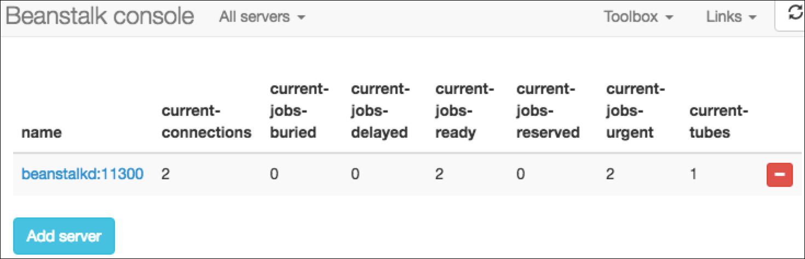
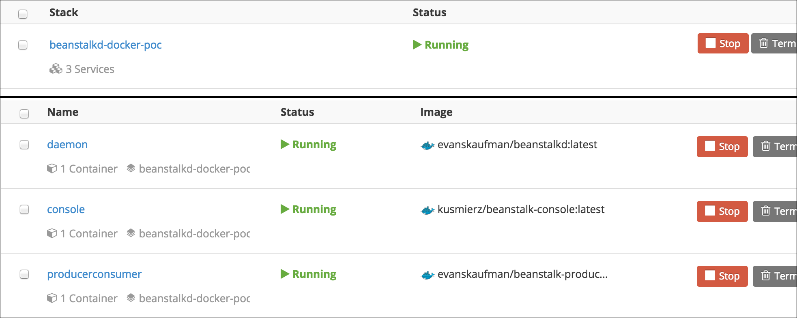
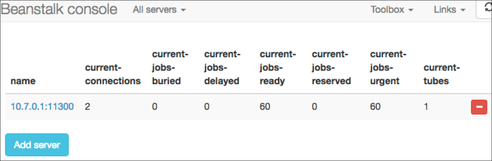

# beanstalkd on Docker POC

### Local environment

You can see this in action, using [Docker Compose](https://docs.docker.com/compose/):

```bash
# create volume and start all services (in background)
docker volume create --name beanlog && \
docker-compose up -d

# open the web console
open "http://$(echo $DOCKER_HOST | \
sed -n 's|tcp://\([0-9.]*\):[0-9]*|\1|p')/"
```

You can actually _watch_ jobs being produced and consumed as you refresh your browser:



Let's test that fault tolerance by killing the `daemon` service and recreating it:

```bash
# simulate a dying container w/ autorestart + persistent volume
# note that jobs PERSIST across containers
docker-compose kill daemon && \
docker-compose rm -f daemon && \
docker-compose up -d daemon

# same as above, but removes the volume
# note that jobs are LOST between containers
docker-compose kill daemon && \
docker-compose rm -f daemon && \
docker volume rm beanlog && \
docker volume create --name beanlog && \
docker-compose up -d daemon
```

### Cloud environment

As well, you can see it running against [Docker Cloud](https://docs.docker.com/docker-cloud/):

```bash
# start all services in the stack
docker-cloud stack up
```

At this point, you should see one stack with three services:



Next, you can open the web console:

```bash
# open the web console
open $( \
  docker-cloud container inspect $( \
    docker-cloud container ps | \
    grep beanstalk-console | \
    awk '{print $2}' \
  ) | \
  grep endpoint_uri | \
  sed -n 's|.*\(http://[a-z0-9.:-]*/\).*|\1|p' \
)
```

Click "Add server" and give it the hostname of the `daemon` service (which you can find in the `producerconsumer`'s log), and you can watch jobs being produced and consumed:



To add a little chaos, and test that the binlog is retained across containers, you can redeploy the `daemon` service:

```bash
# destroy + recreate the beanstalkd container
docker-cloud service redeploy daemon
```

Check the web console again, and you'll find that the counts have _not_ reset to zero -- **meaning binlog persistance is working**!

> Note: at this point, the `producerconsumer` service may hang or fail, trying to connect to beanstalkd. Leave it be, and it should keep restarting until a connection can be made.
> 
> **In production use, producers or consumers that fail to connect to the job queue should handle failure gracefully, instead of letting the app die.**